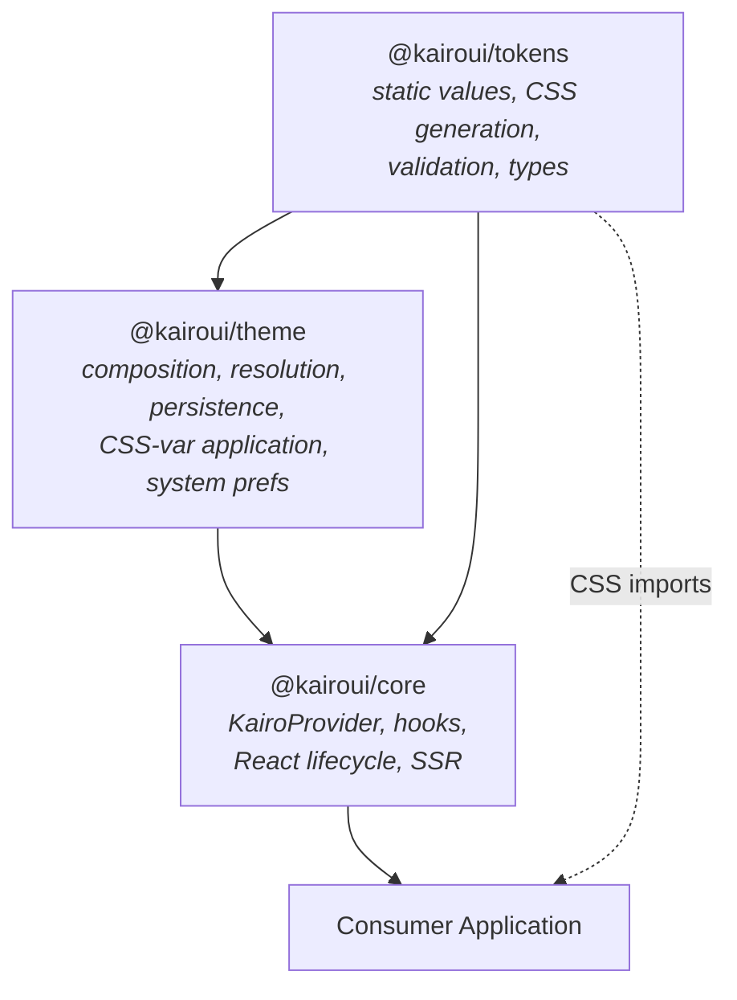
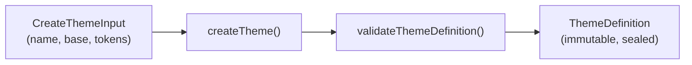
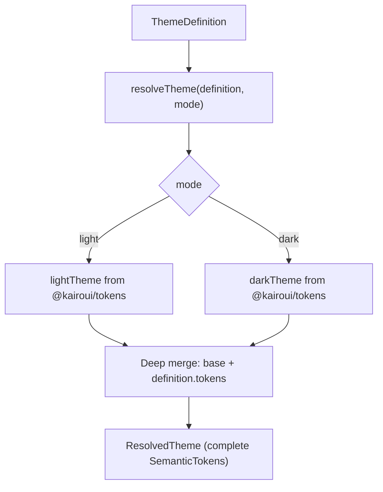
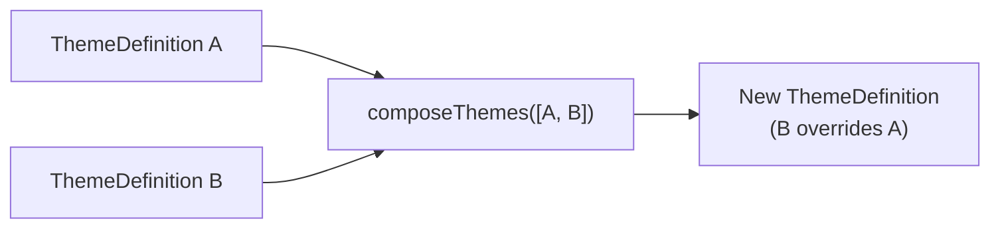
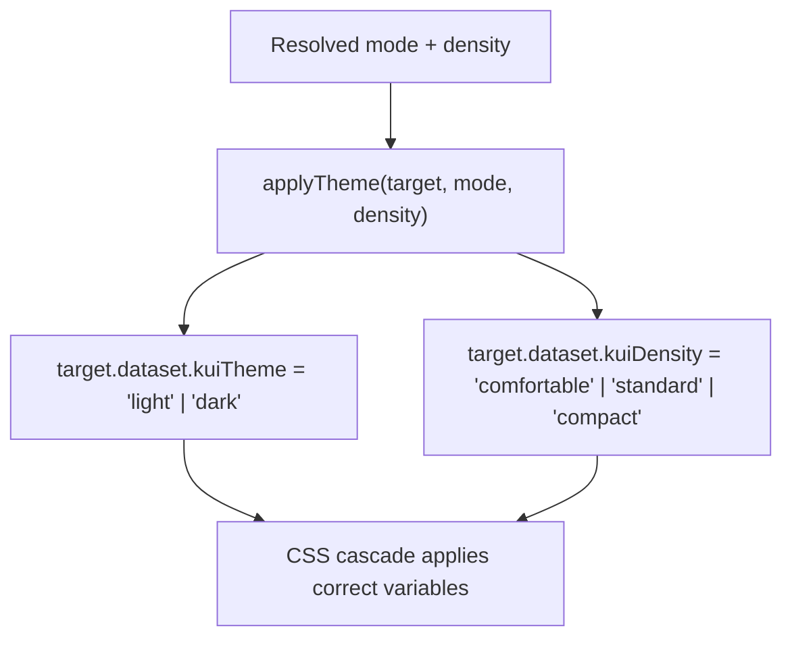
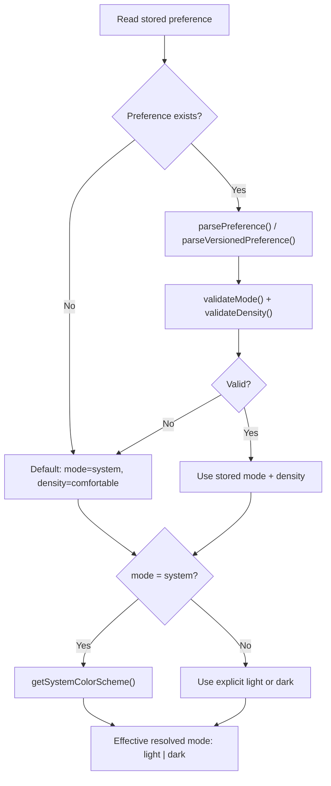
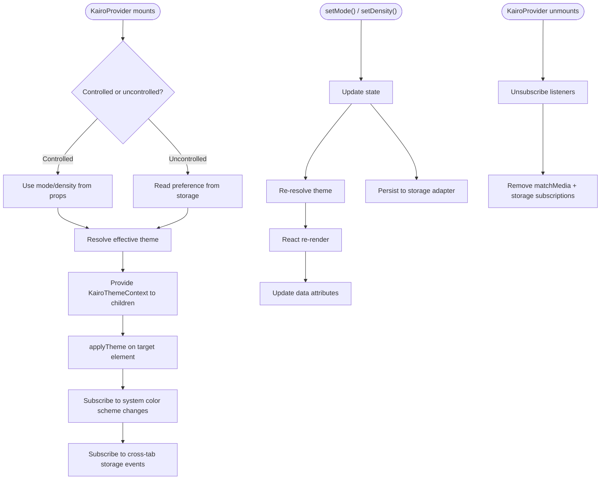
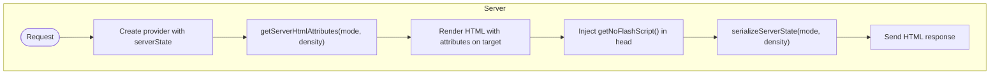

# Theme Engine Architecture

The theme engine transforms KairoUI's static design tokens into a runtime theming system. It is split across three packages with a strict dependency direction.

## Package Dependency Direction



**Invariants:**

- `@kairoui/tokens` never imports from `theme` or `core`.
- `@kairoui/theme` never imports from `core` or React.
- `@kairoui/core` is the only package that imports React.
- All three packages are tree-shakeable ESM with `sideEffects: false`.

## Package Responsibilities

### @kairoui/tokens

Owns all design token values, type contracts, CSS generation, and validation. Has zero runtime dependencies. Produces pre-built CSS files that the theme engine switches between at runtime.

### @kairoui/theme

Owns the framework-independent theme engine. Exports via three entry points:

| Entry                   | Purpose                                                        |
| ----------------------- | -------------------------------------------------------------- |
| `@kairoui/theme`        | Theme creation, composition, resolution, validation, selectors |
| `@kairoui/theme/dom`    | DOM application, system detection, localStorage, cross-tab     |
| `@kairoui/theme/server` | No-flash script, server state serialization, HTML attributes   |

Does not depend on React. All module-level code is SSR-safe (no browser globals at import time).

### @kairoui/core

Owns the React integration: `KairoProvider`, typed hooks, scoped providers, SSR rendering, and hydration. Peer-depends on `react ^18 || ^19`.

---

## Theme Definition Lifecycle

A **theme definition** is a named, validated configuration object created via `createTheme()`:



Theme definitions are pure data — they do not reference the DOM or React.

## Resolution Lifecycle

Resolution determines the complete token set for a given mode and definition:



The resolved theme is immutable after creation.

## Composition Lifecycle

Multiple theme definitions compose into a single definition via `composeThemes()`:



Later themes in the array take precedence. Merge utilities (`mergeThemeOverrides`, `mergeColorOverrides`, `mergeTypographyOverrides`) handle deep partial merging.

## CSS-Variable Generation

The engine does **not** generate CSS at runtime. Token CSS is pre-built by `@kairoui/tokens`:

| File                      | Selector                          | Contents                  |
| ------------------------- | --------------------------------- | ------------------------- |
| `tokens.css`              | `:root` + `[data-kui-theme=dark]` | All light + dark vars     |
| `density/comfortable.css` | `[data-kui-density=comfortable]`  | Comfortable spacing/sizes |
| `density/standard.css`    | `[data-kui-density=standard]`     | Standard spacing/sizes    |
| `density/compact.css`     | `[data-kui-density=compact]`      | Compact spacing/sizes     |

`serializeTheme()` and `generateCssVariables()` in `@kairoui/theme` can produce CSS variable maps from a resolved theme for inspection or tooling, but the runtime relies on attribute switching.

## DOM Application

DOM application uses `data-` attributes rather than inline styles:



Key functions from `@kairoui/theme/dom`:

- `applyTheme(target, mode, density)` — sets attributes and tracks state
- `removeTheme(target)` — removes attributes and tracked CSS properties
- `applyScopedTheme(element, options)` — applies to a sub-tree
- `removeScopedTheme(element)` — removes scoped theme
- `cleanupTheme(target)` — full cleanup of all managed state

## Preference Resolution



`resolvePreference()` performs this logic and returns the effective mode + density.

## Storage Adapters

The `StorageAdapter` interface decouples persistence from implementation:

```typescript
interface StorageAdapter {
  get(key: string): string | null;
  set(key: string, value: string): void;
  remove(key: string): void;
  subscribe?(key: string, callback: (value: string | null) => void): () => void;
}
```

Built-in adapters:

| Adapter                       | Package              | Use case           |
| ----------------------------- | -------------------- | ------------------ |
| `createLocalStorageAdapter()` | `@kairoui/theme/dom` | Browser production |
| `createMemoryAdapter()`       | `@kairoui/theme`     | Unit tests         |
| `noopStorageAdapter`          | `@kairoui/theme`     | SSR / static       |

## System Detection

System color scheme detection from `@kairoui/theme/dom`:

- `getSystemColorScheme()` — returns `"light"` or `"dark"` from `matchMedia`
- `isColorSchemeSupported()` — checks if `prefers-color-scheme` is available
- `subscribeToColorScheme(callback)` — calls back on OS-level preference changes

These are lazy — they access `window.matchMedia` only when called, never at import time.

## Provider Lifecycle



## Scope Inheritance

`KairoScopeProvider` creates nested theme regions:

```html
<html data-kui-theme="light" data-kui-density="comfortable">
  <!-- page: light + comfortable -->
  <div data-kui-theme="dark" data-kui-density="compact">
    <!-- scoped: dark + compact -->
  </div>
</html>
```

Inheritance rules:

- A scoped theme overrides all color variables within its sub-tree.
- A scoped density overrides all spacing variables within its sub-tree.
- Unset properties inherit from the parent via CSS cascade.
- `useIsNested()` returns `true` inside a `KairoScopeProvider`.

## Density Inheritance

Density is orthogonal to color mode. It controls spatial tokens (control heights, padding, gaps) without affecting colors or typography.

| Density       | Use case                             |
| ------------- | ------------------------------------ |
| `comfortable` | Default — spacious layout            |
| `standard`    | Moderate density                     |
| `compact`     | Dense — data tables, toolbars, forms |

`useDensity()` returns the current density and a setter. Nested providers inherit the parent's density unless explicitly overridden.

## SSR Lifecycle



Server-side rendering uses `@kairoui/theme/server`:

- `getServerHtmlAttributes(mode, density)` — returns `{ "data-kui-theme": "light", "data-kui-density": "comfortable" }`
- `getNoFlashScript(options)` — returns minified inline script content
- `serializeServerState(mode, density)` — serializes state for hydration pickup

## Hydration Lifecycle

```mermaid
flowchart TD
    subgraph Client
        RECEIVE(["Browser receives HTML"]) --> PAINT["First paint with server theme"]
        PAINT --> NOFLASH["No-flash script executes<br/>(synchronous, before React)"]
        NOFLASH --> READ["Read localStorage preference"]
        READ --> SYSTEM["Check prefers-color-scheme if mode=system"]
        SYSTEM --> PATCH["Patch data-kui-theme + data-kui-density<br/>if different from server default"]
        PATCH --> HYDRATE(["React hydrates"])
        HYDRATE --> PROVIDER["KairoProvider reads DOM attributes"]
        PROVIDER --> MATCH["State matches DOM → no mismatch"]
        MATCH --> OWN["Provider takes ownership of attributes"]
    end
```



The hydration contract: `KairoProvider` with `serverState` reads the current DOM attributes (already corrected by the no-flash script) and initializes state to match, preventing hydration mismatches.

## No-Flash Lifecycle

The no-flash script prevents a flash of the wrong theme between first paint and React hydration:

1. Inline `<script>` in `<head>` runs synchronously before first paint.
2. Reads preference from `localStorage` (key: `kui-theme-preference`).
3. If mode is `"system"`, checks `matchMedia("(prefers-color-scheme: dark)")`.
4. Sets `data-kui-theme` and `data-kui-density` on `document.documentElement`.
5. All of this happens before the browser paints, so the user never sees a flash.

Two variants:

- `getNoFlashScript()` — minified, production-ready
- `getNoFlashScriptReadable()` — formatted, for debugging

## Development Diagnostics

In development (`process.env.NODE_ENV !== "production"`), the theme engine emits warnings:

| Diagnostic                         | Trigger                                   |
| ---------------------------------- | ----------------------------------------- |
| `warnMissingProvider`              | Hook called outside `KairoProvider`       |
| `warnInvalidThemeDefinition`       | Invalid theme passed to provider          |
| `warnControlledUncontrolledSwitch` | Switching between controlled/uncontrolled |
| `warnInvalidMode`                  | Invalid mode value                        |
| `warnInvalidDensity`               | Invalid density value                     |
| `devWarn`                          | General development warning utility       |

All diagnostics are tree-shaken from production builds. `inspectTheme()` and `inspectResolvedTheme()` provide runtime introspection for debugging.

---

## Architectural Constraints

1. **No runtime CSS generation.** The engine switches pre-built CSS via attributes, never generates styles at runtime.
2. **No browser globals at import time.** All DOM/storage/matchMedia access is lazy (inside functions).
3. **No mutation of input objects.** Theme definitions, overrides, and preferences are immutable after creation.
4. **No React in `@kairoui/theme`.** The theme package is framework-independent.
5. **No global singletons.** State lives in the provider, not module scope.
