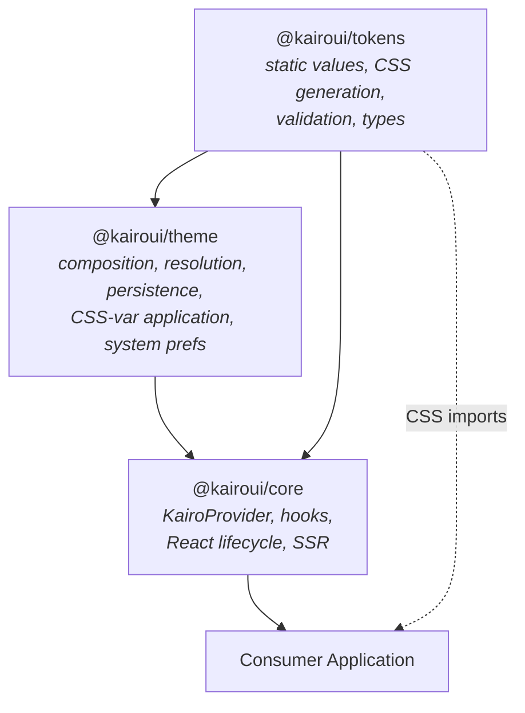
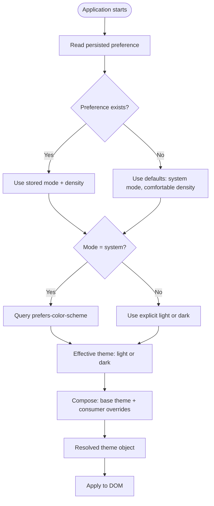
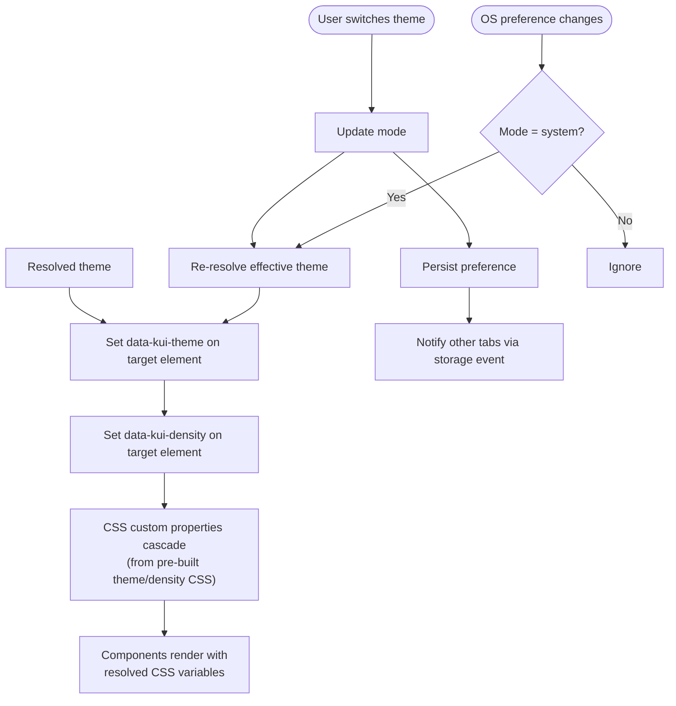
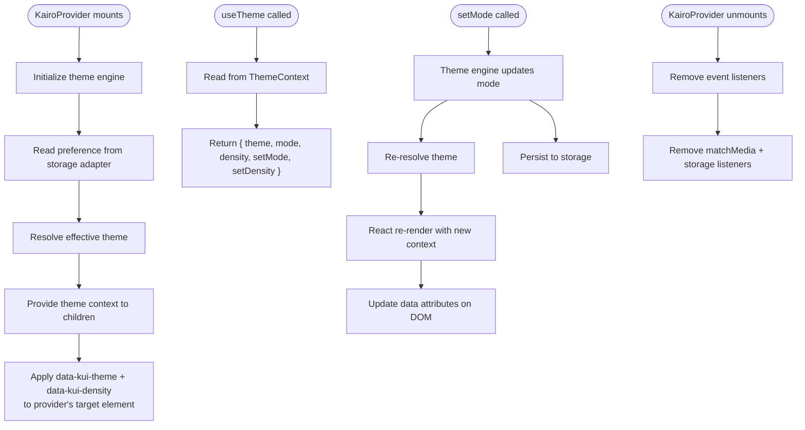
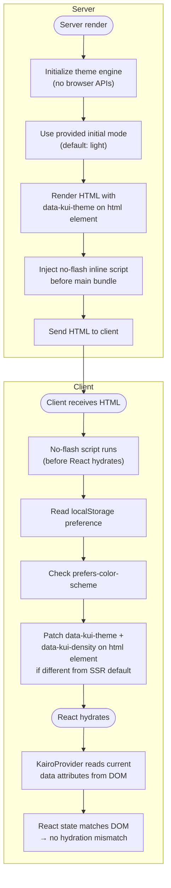

# Theme Engine Architecture

This document defines the architecture for KairoUI's runtime theme engine — the bridge between the static design-token foundation and live applications.

## Package Dependency Direction

```
@kairoui/tokens          (framework-independent, zero dependencies)
        ↓
@kairoui/theme           (framework-independent, depends on tokens)
        ↓
@kairoui/core            (React integration, depends on theme + tokens)
```

**Invariants:**

- `@kairoui/tokens` never imports from `theme` or `core`.
- `@kairoui/theme` never imports from `core` or React.
- `@kairoui/core` is the only package that imports React.
- All three packages are tree-shakeable ESM.



## Package Responsibilities

### @kairoui/tokens — Static Token Foundation

**Owns:** design values, type contracts, CSS generation, validation.

| Responsibility               | Description                                                   |
| ---------------------------- | ------------------------------------------------------------- |
| Primitive tokens             | Raw color scales, spacing, typography, shadows, motion, etc.  |
| Semantic tokens              | Purpose-driven mappings (background.page, text.primary, etc.) |
| Component token contracts    | Button, form, surface, navigation token shapes                |
| Light and dark theme objects | Complete `SemanticTokens` for each scheme                     |
| Density definitions          | comfortable, standard, compact token sets                     |
| CSS generation               | `generateCss()`, `generateThemeCss()`, `generateDensityCss()` |
| CSS files                    | Pre-built `tokens.css`, theme and density CSS                 |
| JSON manifest                | Machine-readable token catalog                                |
| Validation                   | Schema, contrast, structure checks                            |
| Theme override utility       | `resolveTheme()` for partial overrides                        |

**Does not own:** runtime switching, persistence, DOM manipulation, React context.

### @kairoui/theme — Framework-Independent Theme Engine

**Owns:** theme composition, resolution, runtime application, persistence, system preferences.

| Responsibility              | Description                                                     |
| --------------------------- | --------------------------------------------------------------- |
| Theme definition type       | Shape consumers use to define custom themes                     |
| Theme composition           | Merging base themes with partial overrides                      |
| Theme resolution            | Selecting which theme to apply given mode + preferences         |
| CSS-variable application    | Setting `data-kui-theme` and `data-kui-density` on DOM elements |
| System preference detection | Reading `prefers-color-scheme` via `matchMedia`                 |
| Preference persistence      | Storing theme/density choices (adapter-based)                   |
| Cross-tab synchronization   | Reacting to storage events from other tabs                      |
| Scoped theming              | Applying themes to sub-trees, not just `<html>`                 |
| No-flash script             | Inline script snippet for early theme application               |

**Does not own:** React context, hooks, provider lifecycle, component rendering.

**SSR constraint:** All module-level code must be safe when `window`, `document`, `localStorage`, and `matchMedia` are unavailable. Browser APIs are accessed only inside functions called at runtime.

### @kairoui/core — React Integration

**Owns:** React provider, hooks, SSR/hydration lifecycle.

| Responsibility                | Description                                            |
| ----------------------------- | ------------------------------------------------------ |
| `KairoProvider`               | React context provider wrapping the theme engine       |
| `useTheme()`                  | Hook returning resolved theme, mode, and setters       |
| `useDensity()`                | Hook returning current density and setter              |
| `useThemeScope()`             | Hook for nested/scoped theme regions                   |
| Controlled/uncontrolled modes | Provider supports both patterns                        |
| SSR rendering                 | Server-safe initial render without browser globals     |
| Hydration                     | Client picks up server-rendered theme without mismatch |
| React lifecycle               | Subscribing to theme-engine events, cleanup on unmount |

**Does not own:** theme resolution logic, persistence adapters, CSS generation.

## Core Concepts

### Theme Definition

A **theme definition** is a named set of semantic token overrides that the theme engine can apply at runtime.

```
ThemeDefinition {
  name: string
  colors: SemanticColors (partial or full)
  typography: SemanticTypography (optional)
  elevation: SemanticElevation (optional)
  interaction: SemanticInteractionStates (optional)
}
```

KairoUI ships two built-in theme definitions: `light` and `dark`. Consumers may create custom themes by extending a base.

### Resolved Theme

A **resolved theme** is the final, complete `SemanticTokens` object after merging the base theme with any consumer overrides. The resolution process:

1. Start with the base theme (light or dark `SemanticTokens` from `@kairoui/tokens`).
2. Apply the consumer's partial override (if any) via deep merge.
3. Validate the result (no missing leaves, no invalid values).
4. The resolved theme is immutable — never mutated after creation.

### Theme Mode

The **theme mode** determines which color scheme is active:

| Mode       | Behavior                                  |
| ---------- | ----------------------------------------- |
| `"light"`  | Always use light theme                    |
| `"dark"`   | Always use dark theme                     |
| `"system"` | Follow `prefers-color-scheme` media query |

When mode is `"system"`, the engine listens for media-query changes and switches themes automatically.

### Theme Preference

A **theme preference** is the user's persisted choice:

```
ThemePreference {
  mode: "light" | "dark" | "system"
  density: "comfortable" | "standard" | "compact"
}
```

Preferences are stored via a **storage adapter** (localStorage by default, configurable for SSR or custom backends).

### Density

**Density** controls spatial tokens (control heights, padding, gaps) without affecting colors or typography. It is orthogonal to theme mode.

The engine applies density by setting `data-kui-density` on the target element, which activates the corresponding CSS custom-property overrides from the pre-built density CSS files.

### Theme Scope

A **theme scope** is a DOM sub-tree with its own theme or density, independent of the page-level theme.

```html
<html data-kui-theme="light" data-kui-density="comfortable">
  <!-- page-level: light + comfortable -->
  <div data-kui-theme="dark" data-kui-density="compact">
    <!-- scoped: dark + compact -->
  </div>
</html>
```

Scoped themes work because CSS custom properties cascade. The density and theme CSS files use attribute selectors (`[data-kui-theme="dark"]`, `[data-kui-density="compact"]`) that override variables within their scope.

### Theme Inheritance

Nested scopes inherit unset properties from their parent via CSS cascade:

- A scoped `data-kui-theme="dark"` overrides all color variables within that sub-tree.
- A scoped `data-kui-density="compact"` overrides all density variables within that sub-tree.
- If only density is scoped, colors inherit from the parent theme.
- If only theme is scoped, density inherits from the parent density.

## Theme Resolution Lifecycle



## Runtime Theme Application Lifecycle



## React Provider Lifecycle



## SSR and Hydration Lifecycle



### No-Flash Script

The no-flash script is a small inline `<script>` that runs before the main JavaScript bundle. It:

1. Reads the user's persisted theme preference from `localStorage`.
2. Checks `window.matchMedia("(prefers-color-scheme: dark)")` if mode is `"system"`.
3. Sets `data-kui-theme` and `data-kui-density` on `document.documentElement`.
4. This happens synchronously before the first paint, preventing a flash of the wrong theme.

The theme package exports a function to generate this script as a string (for SSR frameworks to inject into `<head>`).

### Hydration Contract

When React hydrates on the client:

1. `KairoProvider` reads the current `data-kui-theme` and `data-kui-density` from the DOM (already set by the no-flash script).
2. It initializes its state to match those DOM values.
3. Because the React state matches the DOM, there is no hydration mismatch.
4. After hydration, `KairoProvider` takes ownership of the attributes and manages them via the theme engine.

## Consumer Overrides

Consumers can customize themes at two levels:

### 1. Theme-level overrides (via provider config)

```typescript
// Consumer creates a custom theme by partially overriding the default
const customTheme = {
  name: "brand",
  base: "light",
  overrides: {
    color: {
      interactive: {
        default: "#0066cc",
        hover: "#0052a3",
      },
    },
  },
};
```

The theme engine deep-merges the overrides onto the base theme, validates the result, and applies it. Only supported semantic token paths may be overridden.

### 2. Density overrides (via provider config)

Consumers select a density mode. Custom density values are not supported in Phase 3 — the three built-in modes cover the use cases.

## Persistence Architecture

```
┌──────────────┐     ┌──────────────────┐     ┌─────────────┐
│ Theme Engine │────▶│ Storage Adapter   │────▶│ localStorage│
│              │◀────│ (interface)       │◀────│ (default)   │
└──────────────┘     └──────────────────┘     └─────────────┘
                            │
                            ▼
                     ┌─────────────┐
                     │ Custom impl │
                     │ (SSR, test) │
                     └─────────────┘
```

The storage adapter is an interface with `get`, `set`, and `subscribe` methods. This allows:

- **Browser:** `localStorage` with `storage` event for cross-tab sync.
- **SSR:** A no-op adapter that returns defaults.
- **Testing:** An in-memory adapter for deterministic tests.

## Public vs Internal APIs

### Public API (`@kairoui/theme`)

| Export                 | Type     | Purpose                                           |
| ---------------------- | -------- | ------------------------------------------------- |
| `createTheme()`        | Function | Create a validated theme definition               |
| `composeTheme()`       | Function | Merge base theme with partial overrides           |
| `resolveMode()`        | Function | Determine effective light/dark from mode + system |
| `createThemeEngine()`  | Function | Create the runtime theme engine instance          |
| `getNoFlashScript()`   | Function | Generate the inline no-flash script string        |
| `ThemeDefinition`      | Type     | Shape of a theme definition                       |
| `ThemeMode`            | Type     | `"light" \| "dark" \| "system"`                   |
| `DensityMode`          | Type     | `"comfortable" \| "standard" \| "compact"`        |
| `ThemePreference`      | Type     | Persisted preference shape                        |
| `ThemeEngine`          | Type     | Runtime engine interface                          |
| `StorageAdapter`       | Type     | Persistence adapter interface                     |
| `localStorageAdapter`  | Const    | Default browser storage adapter                   |
| `noopStorageAdapter`   | Const    | SSR/test adapter                                  |
| `memoryStorageAdapter` | Function | In-memory adapter factory for tests               |

### Public API (`@kairoui/core`)

| Export                | Type      | Purpose                               |
| --------------------- | --------- | ------------------------------------- |
| `KairoProvider`       | Component | Root theme provider                   |
| `useTheme()`          | Hook      | Access resolved theme + setters       |
| `useDensity()`        | Hook      | Access current density + setter       |
| `useResolvedTokens()` | Hook      | Access the full resolved token object |
| `KairoScopeProvider`  | Component | Scoped theme region                   |

### Internal (not exported)

- Theme engine event subscriptions
- DOM attribute mutation logic
- Media query listener management
- Storage serialization format

## CSS Architecture

The theme engine does **not** generate CSS at runtime. Instead it relies on the pre-built CSS files from `@kairoui/tokens`:

| File                      | Selector                            | Contents                                   |
| ------------------------- | ----------------------------------- | ------------------------------------------ |
| `tokens.css`              | `:root` + `[data-kui-theme="dark"]` | All variables for light (default) and dark |
| `themes/light.css`        | `:root`                             | Light theme variables only                 |
| `themes/dark.css`         | `[data-kui-theme="dark"]`           | Dark overrides only                        |
| `density/comfortable.css` | `[data-kui-density="comfortable"]`  | Comfortable spacing/sizing                 |
| `density/standard.css`    | `[data-kui-density="standard"]`     | Standard spacing/sizing                    |
| `density/compact.css`     | `[data-kui-density="compact"]`      | Compact spacing/sizing                     |

Runtime theme switching works by changing the `data-kui-theme` attribute value. The browser's CSS cascade immediately applies the correct variable values — no JavaScript-driven style updates needed.

## Testing Strategy

| Layer                        | Test type                         | Package          |
| ---------------------------- | --------------------------------- | ---------------- |
| Theme composition/resolution | Unit tests (Vitest)               | `@kairoui/theme` |
| Storage adapters             | Unit tests (Vitest)               | `@kairoui/theme` |
| System preference detection  | Unit tests with `matchMedia` mock | `@kairoui/theme` |
| No-flash script output       | Snapshot test                     | `@kairoui/theme` |
| KairoProvider rendering      | React component tests (RTL)       | `@kairoui/core`  |
| Hook behavior                | React hook tests (renderHook)     | `@kairoui/core`  |
| SSR rendering                | Node-based render test            | `@kairoui/core`  |
| Hydration mismatch           | Client + server render comparison | `@kairoui/core`  |
| Consumer integration         | Built-output import tests         | Separate fixture |

## Constraints

1. **No runtime CSS generation.** The theme engine switches pre-built CSS, never generates CSS strings at runtime.
2. **No global singletons.** The theme engine is instantiated per provider, not stored in a module-level variable.
3. **No synchronous browser API access at import time.** All browser APIs are called lazily.
4. **No mutation of input objects.** Theme definitions and overrides are treated as immutable.
5. **No React in `@kairoui/theme`.** The theme package is framework-independent.
